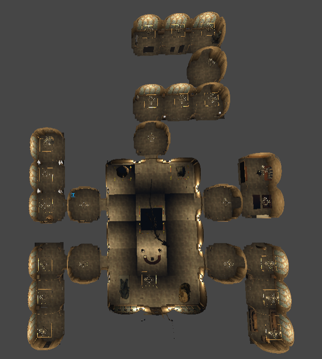

# NightCurator — Psychological Horror Game

## 🎮 Game Overview
*NightCurator* is a first-person psychological horror game where you play as a night security guard assigned to monitor a mysterious museum.

Each night, strange paranormal anomalies begin to appear. Your job is to identify and neutralize them before time runs out.

---

## 🕹️ Gameplay Loop
- Start each shift at the guard post
- Read instructions to understand anomaly behavior
- Explore the museum to locate the active entity
- Use tools to resolve paranormal events
- Survive the shift and progress to the next night

Each shift introduces different combinations of anomalies, increasing difficulty and tension.

---

## ✅ Success & ❌ Failure

### ✅ Shift Cleared When:
- You correctly identify and neutralize the anomaly
- You safely return to the guard post

### ❌ Game Over When:
- You fail to resolve anomalies within 10 minutes
- An entity catches you

---

## 👻 Entities & Solutions

### 🗿 Whispering Statue
An ancient Egyptian statue emitting disturbing whispers.

**Solution:**
- Find the UV lens
- Attach it to your flashlight
- Shine UV light on the statue for 5 seconds

---

### 🎵 Ancient Gramophone
Normally plays piano music but may switch to distorted audio.

**Solution:**
- Find the correct vinyl record
- Replace the current disc

---

### 👁️ Angel Statue
Moves when not observed.

**Solution:**
- Locate a laptop
- Activate CCTV monitoring to freeze it

---

### ⚔️ Knight
Aggressively chases the player.

**Solution:**
- Find the King’s Crown
- Place it near the banner to pacify the Knight

---

## 🗺️ Map Layout

- Central Main Hall connects all areas
- 4 Themed Corridors:
  - Egyptian
  - Ancient Artifacts
  - Statues
  - Pots & Warrior Artifacts
- Guard Post (safe zone)

---

## 🧭 User Interface

### Main Menu
- Start Game
- Settings
- Credits
- Exit

### Pause Menu
- Resume
- Restart
- Main Menu

### Settings
- Master Volume
- Music Volume

---

## 🚀 Getting Started
1. Clone the repository
2. Open the project in your game engine (e.g., Unity)
3. Run the game

---

## 👤 Project Members: 
- Abdallah Ghordlo
- Fevzi Berk Çeliktaş
- Hussein Abdikarim
